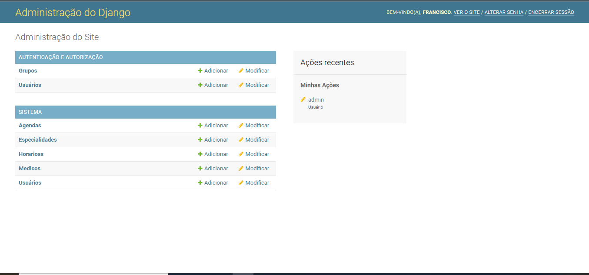

# Projeto Django Clinica

## Informações sobre o autor
Autor: Francisco Leite

Discente em Tecnologia em Análise e Desenvolvimento de Sistemas no IFPI

Link para a apresentação do projeto: <https://www.youtube.com/watch?v=Cj-OsFUxZi4>

## Detalhamento
Nesse projeto iremos criar um sistema web com o Django para uma clínica onde os usuários poderão marcar consultas com um determinado médico de acordo com sua agenda.

Para criação da app django_clinica temos que criar um diretório com o nome que faça referência a aplicação, no caso deste projeto dei o nome de **Clinica** ao diretório. Tenha em mente para execução desse projeto usaremos o ambiente virtual.

## Ferramentas necessárias

Antes de iniciamos a criação do ambiente virtual vamos listar os requisitos para desenvolver a aplicação:

* Tenha o python instalado em sua máquina.
* Tenha o Microsoft Visual Studio Code instalado em sua máquina.(Pode ser outro editor, mas recomento este)
* Tenha o pip instalado em sua máquina.

## Instalando a virtualenv

Para instalar a virtualenv usaremos o gerenciador de pacotes do python(pip), ele funciona via terminal, então o abra e insira o seguinte comando:

`pip install virtualenv`

Após fazer isso, o pacote estará instalado e pronto para ser utilizado.

## Criando uma nova virtualenv

Vamos cria um ambiente virtual com o nome de `myvenv`.
Abra o terminal e insira oseguinte comando:

No windows:

`python -m venv myvenv`

No Linux:

`$ python3 -m venv myvenv`

Ativando o ambiente virtual

Antes da ativação o caminho de diretório do seu ambiente virtual é para está assim:

`PS D:\Projetos_em_Django\Clinica>`

Ativando no Linux:

`. myvenv/bin/activate`

Ativando no Windows:

`myvenv\Scripts\activate`

Após a ativação o camino de diretório de seu ambiente virtual é para está mais ou menos assim:

`(myvenv) PS D:\Projetos_em_Django\Clinica>`

Instalação do framework Django:

`pip install django`

Caso queira desativar o ambiente virtual, no diretório:

`deactivate`

## Criando o projeto Django Clinica

Após termos criado a pasta devemos seguir alguns passos classícos do Django. Dentro da pasta executaremos o seguinte comando:

`django-admin startproject core .`

django-admin é um script que criará os diretórios e arquivos para você. Agora abra o projeto no Microsoft Visual Studio Code(VsCode), basta digitar `code .` no terminal.

Agora, você deve ter uma estrutura de diretório parecida com isso:

~~~ Clinica
├───manage.py
├───core
│        settings.py
│        urls.py
│        wsgi.py
│        __init__.py
├───myvenv
~~~

`manage.py` é um script que ajuda com a gestão do site. Com ele, podemos iniciar um servidor de web no nosso computador sem instalar nada, entre outras coisas.

O arquivo `settings.py` contém a configuração do seu site.

O arquivo `urls.py` contém uma lista dos padrões usados por `urlresolver`.

### Mudando as configurações

Vamos fazer algumas alterações no `core\settings.py`. Abra o arquivo usando o  Vscode.

No início do arquivo faça a importção:

~~~ python
import os
~~~

Vá até o final do arquivo, abaixo da linha com STATIC_URL e adicione uma nova variável chamada STATIC_ROOT:

~~~ python
STATIC_URL = '/static/'
STATIC_ROOT = os.path.join(BASE_DIR, 'static')
~~~

Ainda no `core\settings.py`, localize a linha que contém TIME_ZONE e modifique para escolher seu próprio fuso horário:

~~~ python
TIME_ZONE = 'America/Sao_Paulo'
~~~

Se você quiser que fique em português, altere o LANGUAGE_CODE da seguinte maneira:

~~~ python
LANGUAGE_CODE = 'pt-BR'
~~~

## Criando um banco de dados para a Clínica

Para criar um banco de dados para o nossa clinica, vamos executar o seguinte comando no terminal (precisamos estar no diretório que contém o arquivo manage.py).

`python manage.py migrate`

A gora vamos startar o servidor web com o segunte comando:

`python manage.py runserver`

Acesse a url `http://127.0.0.1:8000/` par ver se o site está funcionando.

Para interromper o seu servidor, volte para a janela onde ele está rodando e pressione `CTRL+C` botões Control e C juntos (no Windows; tente `Ctrl+Break` se o primeiro não funcionar).

## Modelos do Django

Como sabemos os conceitos de classe e objeto vamos criar um modelo para algumas classes do nosso projeto clinica.
Para mais detalhes sobre os modelos django acesse <https://tutorial.djangogirls.org/pt/django_models/>

### Criando uma aplicação

Para manter tudo organizado é interesante criar uma aplicação separada dentro do nosso projeto.

Para isso execute o seguinte comando:

`python manage.py startapp sistema`

Após criar uma aplicação é necessário dizer ao Django que ele deve usá-la. Para isso basta ir no `core\settings.py` e encontrar o `INSTALLED_APPS` e inserir a aplicação da seguinte maneira:

~~~ python
INSTALLED_APPS = [
    'django.contrib.admin',
    'django.contrib.auth',
    'django.contrib.contenttypes',
    'django.contrib.sessions',
    'django.contrib.messages',
    'django.contrib.staticfiles',
    'sistema',
]
~~~

### Criando os modelos para o sistema de nossa Clínica

No arquivo `sistema\models.py` definimos todos os objetos chamados Modelos, é neste lugar que vamos definir os relacionamentos entre as classes que estarão presentes na aplicação `sistema` de nossa clinica.

~~~ python
from django.db import models
from django.conf import settings
from django.contrib.auth.models import User

class Especialidade(models.Model):
    nome = models.CharField(max_length=100, blank=False)

    def __str__(self):
        return self.nome

class Medico(models.Model):
    nome = models.CharField(max_length=200, blank=False, null=False)
    crm = models.CharField(max_length=30, blank=False, null=False)
    email = models.EmailField()
    telefone = models.CharField(max_length=17)
    especialidade = models.ForeignKey(Especialidade, on_delete= models.CASCADE, verbose_name='Especialidade',blank=False)

    def __str__(self):
        return self.nome

class Horarios(models.Model):
    horas = models.CharField(max_length=5, blank=False, null=False)

    def __str__(self):
        return self.horas

class Agenda(models.Model):
    medico = models.ForeignKey(Medico, on_delete=models.CASCADE, verbose_name='Médico Especialista',blank=False)
    data = models.DateField()
    horarios = models.ManyToManyField(Horarios, blank= False)

    def __str__(self):
        return str(self.medico.nome)

class Cliente(User):
    SEXO_CHOISES = (
        ('M','Masculino'),
        ('F','Feminino')
    )
    nome = models.CharField(max_length=200, blank=False, null=False)
    cpf = models.CharField(max_length=14, blank=False, null=False)
    sexo = models.CharField(max_length=1,choices=SEXO_CHOISES,blank=False, null=False)
    telefone = models.CharField(max_length=16)
    consulta = models.ManyToManyField(Agenda, blank=True)
    
    def __str__(self):
        return self.nome

~~~

`ManyToManyField` é a criação de um relacionamento entre tabelas muito-para-muitos. `ForeignKey` é a criação de um relacionamento entre tabelas 1 para muitos.

Note que na classe `Cliente` recebe como parâmetro a herança da classe `User` do Django, pois essa classe está estendendo as caracteristicas da classe `User` para a classe `Cliente` nessa aplicação, ou seja, além dos atributos criados na classe `Cliente` ela contará com os atribuos já existentes na classe `User`, mas aqui os únicos atributos que nos interessa são os de `email, username, password1 e password2`. Esse tipo de configuração na classe `Cliente` foi necessáia para que o usuário(cliente) da clinica possa efetuar logins mais estáveis no site da clínica.

Isso é uma forma de criar usuários personalizados no Django, veja mais acessando <https://docs.djangoproject.com/en/4.0/topics/auth/customizing/>

Ainda na classe `Cliente` note que há um widiget `choices` no atributo `sexo`, esse widget permite que criemos uma lista de opções disponíveis para serem selecionadas, e assim evitando que o usuário possa digitar qualquer coisa nessa opção. Na lista deve haver tuplas, onde o primeiro valor da tupla é o que será aramazenado no banco de dados e o segundo valor é o que o usuário verá no ato do cadastro.

Para mais detalhes sobre `choices` acesse: <https://docs.djangoproject.com/en/4.0/ref/models/fields/#choices>

### Migrando tabelas para nossos modelos no banco de dados

O último passo é adicionar nosso novo modelo ao banco de dados. Primeiramente, precisamos fazer com que o Django entenda que fizemos algumas alterações nos nossos modelos.

`python manage.py makemigrations sistema`

O Django preparou um arquivo de migração que precisamos aplicar ao nosso banco de dados.

`python manage.py migrate sistema`

### Django admin

Para fazermos as operações na página de administrador do Django precisamos fazer umas configurações no `sistema\admin.py`.

Iremos fazer as seguintes edições no código:

~~~ python
from django.contrib import admin
from django.contrib.auth import admin as admin_add #importação que será usado futuramente
from .models import Especialidade, Medico, Horarios, Agenda, Cliente

admin.site.register(Especialidade)
admin.site.register(Medico)
admin.site.register(Horarios)
admin.site.register(Agenda)
admin.site.register(Cliente)
~~~

Para ter acesso ao admin do Django é necessário criar um `superuser`(superusuário). Quando for solicitado, insira seu nome de usuário (letras minúsculas, sem espaços), e-mail e senha. Não se preocupe por não conseguir ver a senha que está digitando pois é assim mesmo.

Vamos criar um superusuário:

`python manage.py createsuperuser`

Agora para testar basta startar o servirdor novamente:

`python manage.py runserver`

E no navegador acessar:

`http://127.0.0.1:8000/admin/`

Faça login com as informações de superusuário que você escolheu, logo você deverá ver o painel de controle de administração do Django.

Se tudo estiver correto você verá algo assim:

Note que não aparece a classe `Cliente` junto com as outras, mas sim uma classe `Usuarios`. Na verdade essa classe é a classe `Cliente`, mas ela aparece no admin como uma classe de usuario do Django devido ao que foi feito lá na classe `Cliente` lá no `sistema\models.py`

## URLs

Uma URL é um endereço da web. Você consegue ver uma URL sempre que acessa algum website pois ela aparece na barra de endereços do seu navegador, por exemplo isso é uma URL `127.0.0.1:8000` e isso `https://djangogirls.org` também é uma URL.

### Entendendo as URLs no Django

Abra o arquivo `core\urls.py` no VsCode e veja o que aparece:

~~~ python
from django.contrib import admin
from django.urls import path

urlpatterns = [
    path('admin/', admin.site.urls),
]
~~~

Essa URL do admin você já acessou quando entrou na página de administrção do Django.

Isso significa que para cada URL que começa com admin/, o Django irá encontrar uma view correspondente. Neste caso nós estamos incluindo várias URLs de admin de uma vez a partir de uma lista criada pelo próprio Django em admin.site.urls. Desta forma, não temos que repetir todas URLs no nosso modesto arquivo, assim é mais legível e mais limpo.

### Criando URLs no Django

Bem, queremos que `http://127.0.0.1:8000/` seja a página inicial da nossa clínica onde estarão disponíveis outras URLs para as demais páginas da clínica.

Também queremos manter o arquivo `core\urls.py` limpo, e portanto importaremos as URLS da nossa aplicação `sistema` no arquivo principal `core\urls.py`.

Vamos adicionar uma linha que importará `sistema.urls` será necessário alterar a linha `from django.urls`... porque nós estamos utilizando a função `include` aqui, então é preciso adicionar aquele `import` para a linha.

O seu arquivo `core\urls.py` deve estar assim agora:

~~~ python
from django.contrib import admin
from django.urls import path, include

urlpatterns = [
    path('admin/', admin.site.urls),
    path('', include('sistema.urls')),
]
~~~

Com isso o Django agora vai redirecionar tudo o que entra em <'http://127.0.0.1:8000/'> para `sistema.urls` e procurar por novas instruções lá.

### Criando a sistema.urls

Crie um arquivo chamado urls.py na pasta `sistema\` do seu projeto.

~~~ python
from django.urls import path
from . import views

urlpatterns = [
    path('', views.home, name='home'),
]
~~~

Como você pode ver, estamos agora atribuindo uma view chamada `home` à URL raiz. Este padrão de URL corresponde a uma sequência de caracteres vazia, e o resolvedor de URLs do Django irá ignorar o nome de domínio (ou seja, <http://127.0.0.1:8000/>) que antecede o caminho completo da URL. Este padrão dirá ao Django que views.home é o lugar correto aonde ir se alguém entra em seu site pelo endereço <http://127.0.0.1:8000/>.

A última parte, `name=home`, é o nome da URL que será usado para identificar a view. Pode ser o mesmo nome da view, mas também pode ser algo completamente diferente. Nós vamos usar URLs nomeadas mais à frente, então é importante nomearmos agora todas as URLs de nossa aplicação.

Caso você tenha tentado acessar a sua página provavelmente recebeu um erro, pois a view home não foi criada ainda no arquivo `sistema\views.py`. Vamos para o próximo passo para corrigir isso!

## Django views

Uma view é o lugar onde nós colocamos a "lógica" da nossa aplicação. Ela vai extrair informações do `model` que você criou e entregá-las a um `template`. As views são colocadas no arquivo `sistema\views.py`.

~~~ python
from django.shortcuts import render
#aqui serão importadas mais pacotes e classes

def home(request):
    return render(request, 'sistema/home.html')
~~~

Como você pode ver, nós criamos uma função (def) chamada `home` que leva a solicitação e irá retornar o valor que recebe ao chamar outra função `render` que irá renderizar (montar) nosso modelo `sistema\home.html`. No entanto temos que criar o arquivo `home.html` para a aplicação funcionar. Para isso temos que criar a pasta `sistema\templates`, elogo depois criar um diretório chamado `sistema`,

A estrutura deve ficar mais ou menos assim:

~~~ Clinica
Clinica
└───sistema
    └───templates
        └───sistema
~~~

Vamos criar o arquivo `home.html`, e nele vamos escrever o seguinte código html.

~~~ html
<html>
    <head>
        <title>Django Clinica</title>
    </head>
    <body>
        
Seja bem vindo!

        
Boas consultas

    </body>
</html>
~~~

Agora vamos startar o servidor web para averiguar como está a nossa aplicação:

`python manage.py runserver`

## QuerySets e ORM do Django

Antes de irmos adiante com o projeto você vai entender como o Django se conecta ao banco de dados e como ele armazena dados. Vamos nessa!

O Django ORM é uma implementação do conceito de mapeamento objeto-relacional (ORM). O ORM do Django é compatível com MySQL, PostgreSQL, SQLite e Oracle.

### O que é um QuerySet?

Um QuerySet (conjunto de busca) é, em essência, uma lista de objetos de um dado modelo. QuerySet permite que você leia os dados a partir de uma base de dados, filtre e ordene.

Para um melhor entemdimento acesse: <https://tutorial.djangogirls.org/pt/django_orm/>

## O Shell do Django

Abra o seu terminal e digite o seguinte comando:

`python manage.py shell`

Agora vamos mostrar os dados já inseridos no nosso banco de dados Sqlite, se você não inseriu nenhum dado no baco de dados ainda vá até a página de admin do Django e insira dados nas classes de lá. Lembrando de fazer a importação das classes, incluindo a classe `User` do django no shell se não as consultas retornarão erros, nesse caso vamos usar apenas 3 de nossas classes.

~~~ python
from sistema.models import Especialidade, Cliente, Medico
from django.contrib.auth.models import User
~~~

~~~ python
Especialidade.objects.all() #mostrando todos os dados da tabela Especialidade. Equivalente ao SELECT * FROM Especialidade;
~~~

~~~ python
Cliente.objects.all() #mostrando todos os dados ta tabela Cliente. Equivalente ao SELECT * FROM Cliente;
~~~

~~~ python
Medico.objects.all() #mostrando todos os dados ta tabela Medico. Equivalente ao SELECT * FROM Medico;
~~~

Pelo shell podemos inserir no banco de dados mais dados as nossas classes, aqui vamos inserir uma categoria:

~~~ python
Especialidade.objects.create(nome="Pediatra") #Equivalente a: INSERT INTO Especialidade(nome) VALUES (value1);
~~~

### Filtrando objetos

O dos recursos de muita importancia dos QuerySets é a possibilidade de filtrar os objetos do banco de dados.

Por exemplo, caso você queira fazer uma busca das Especialidades que tem a letra P no nome basta fazer assim:

~~~ python
Especialidade.objects.filter(nome__contains='A') #Equivalente a: SELECT * FROM Especialidade WHERE nome LIKE '%A%';
~~~

Bem, há outras diverssas formas de filtrar objetos por meio dos QuerySets. Para mais informações acesse <https://docs.djangoproject.com/en/4.0/topics/db/queries/>

Para sair do shell:

`exit()`

## Dados dinâmicos em templates

Até o momento temos diferentes peças: o modelo `Agenda` está definido lá no `sistema\models.py`, mas até agora não temos nenhum meio para exibir os objetos referentes a essa classe em um template HTML. Então são as `views` que irão fazer isso para nós.

Bem primeiramente vamos até o `sistema\urls.py` e criaremos uma URL para listagem de agendas:

~~~ python
from django.urls import path
from . import views

urlpatterns = [
    path('', views.home, name='home'),
    #Listagem
    path('listar_agendas', views.listar_agendas, name='listar_agendas'),
]
~~~

Agora que criamos a URL `listar_agendas` devemos criar a view referente essa URL, então vamos no arqquivo `sistema\views.py` fazemos a importação da classe `Agenda`(pode fazer das outras também para usar mais adiante) criamos uma `def` com o nome *listar_agendas*, nessa função ieremos usar um ORM para selecionar todas as agendas e encaminhar para um template HTML:

~~~ python
from django.shortcuts import render
from sistema.models import Agenda

def listar_agendas(request):
    agendas = Agenda.objects.all()
    return render(request, 'sistema/listar_agendas.html', {'agendas':agendas})
~~~

Repare que na função *listar_agendas* há uma variável `agenda` que recebe o retorno da busca dos objetos de Agenda, e que no `return` da função vamos redenrizar uma página HTML e que dentro de um dicionário passamos a variável `agenda` para ser exibido no template que iremos criar agora:

Em `templates\sistema` vamos criar o aquivo `listar_agendas.html`. Para que possamos percorrer a lista de agendas devemos utilizar um laço de repetição, para isso usaremos o `for`:

~~~ html
<html>
    <head>
        <title>Django Clinica</title>
    </head>
    <body>
        <h1>Lista das nossas Agendas</h1>
    
        
<strong>Agenda: {{agenda.id}}</strong>

        {{agenda.medico}} 
        Especialidade: {{agenda.medico.especialidade}} 
        Disponível no dia: {{agenda.data}} 
         
    
    </body>
</html>
~~~

Agora vamos fazer uma alteração no arquivo `home.html`, vamos inserir a URL nela para que possa ser possível exibir a template de listar agendas, ou seja, inserir a url referente a view *listar_agendas*:

~~~ html
<html>
    <head>
        <title>Django Clinica</title>
    </head>
    <body>
        
Seja bem vindo!

        
Boas consultas

        <h2>LINKS</h2>
        <a href="">listar_agendas</a> 
    </body>
</html>
~~~

Agora é só startar o servidor e verificar se está tudo certo.

## Trabalhando com frameworks de HTML, CSS e JavaScript

Vamos deixar nossos templates mais bonitos e criar uma base para eles. Para isso vamos o usar o *bootstrap*, pois é um bom framework que tem várias templates prontas para uso, iremos baixar os disponíveis no site:

Nessa etapa vamos criar um template que vai servir de base para os demais, assim evita ficar repitindo um certo processo de configuração do HTML, CSS E JS em todas as templates, ou seja, as donfigurações são feitas apenas em um só arquivo, então vamos aproveitar esse recuro que o Djando nos disponibiliza. Faça o download dos exemplos do bootstrap no link abaixo.

<https://getbootstrap.com/docs/5.0/getting-started/download/>

Após fazer o download dos exemplos do bootstrap extraia os arquivos.

Antes do próximo passo vá em `Clinica\sistema` e crie o diretório `static`:

~~~ Clinica
sistema
    └───templates
    └───static
~~~

Vamos utilizar o exemplo `navbar-fixed`, iremos também utilizar duas pastas `(css, js)` com arquivos muito importantes para a configuração das nossas páginas, presente no arquivo baixado que estão na pasta:

~~~ bootstrap
assets
|
|---dist
       |---css
       |--- js
~~~

Copie os arquivos que estão dentro da `navbar-fixed` e cole dentro da pasta `static` de seu pojeto. Faça o mesmo processo com as pastas `css` e `js`.

Vamos agora criar um arquivo `base.html` em `templates\sistema`. Agora copiaremos tudo o que tem no arquivo `index.html` que está na pasta `static` e colaremos dentro do arquivo `base.html` que acabamos de criar e vamos configurar ele:

No topo do arquivo *base.html* vamos por o carregamento dos dados que estão presentes na pasta `static`:

~~~ html


<!doctype html>
<html lang="en">
    <head> 
~~~

Outros trechos devem ser alterados para poderem funcionar bem, vamos criar dois links para para caregar o `bootstrap.min.css` e o `navbar-top-fixed.css` da base:

~~~ html
''' código escondido'''
    <!-- Bootstrap core CSS -->
    <link rel="stylesheet" href="">
    <link rel="stylesheet" href="">
''' código omitido'''
~~~

E no fim do arquivo vamos configurar o link para o javascript.

~~~ html

~~~

Dentro da `
` que está dentro da tage `<main>` vamos apagar tudo que tem lá e vamos por um bloco onde as informações serão mostradas na template.

Deve ficar dessa forma:

~~~ html


<!doctype html>
<html lang="en"><!--Caso queira mudar a base para português altera assim: lang="pt-br"-->
    <head> 
    
'''código omitido'''
<main class="container">
  

        

            <!--LOCAL ONDE OS DADOS SERÃO INSERIDOS--->
      
        
  

</main>

'''código omitido'''
~~~

Com todas essas configurações o arquivo `sistema\listar_agendas.html` fica agora da seguinte forma:

~~~ html



    <h1>Lista das nossas Agendas</h1>
    
        
<strong>Agenda: {{agenda.id}}</strong>

        {{agenda.medico}} 
        Especialidade: {{agenda.medico.especialidade}} 
        Disponível no dia: {{agenda.data}} 
         
    

~~~

E o arquivo `sistema\home.html` deve ficar assim:

~~~ html



    <h1>Seja bem vindo!</h1>
        
Boas consultas

        <h2>LINKS</h2>
        <a href="">listar_agendas</a> 

~~~

Starte o servidor e verifique como ficou tudo agora.

### Detalhando informções de uma agenda

Vamos agora fazer uma nova URL e uma nova view que leve as informações de uma agenda para uma template em partucular. Vmaos criar um botão para cada agenda na template `listar_agendas.html` dessa forma(e dá uma organizada amais no HTML):

~~~ html




    <h1>Lista das nossas Agendas</h1>
    <table class="table">
    
        <tr>
            <td>
                
<strong>Agenda: {{agenda.id}}</strong>

                {{agenda.medico}} 
                Especialidade: {{agenda.medico.especialidade}} 
                Disponível no dia: {{agenda.data}} 
                <td>
                    <a class="btn btn-default" href="">
                        <button type="button" class="btn btn-primary">Detalhar</button>
                    </a>
                </td>
            </td>
        </tr>
    
    </table>


~~~

Vamos no `sistema\urls.py` criar uma nova rota assim:

~~~ python
from django.urls import path
from . import views

urlpatterns = [
    path('', views.home, name='home'),
    #Listagem
    path('listar_agendas', views.listar_agendas, name='listar_agendas'),
    path('detalhar_agenda/<int:id>/', views.detalhar_agenda, name='detalhar_agenda'),#nova rota
]
~~~

Agora temos que criar uma função no `sistema\views.py` para receber o `id` da agenda na qual o usuário quer detalhar:

~~~ python
from django.shortcuts import render, get_object_or_404
from sistema.models import Agenda

'''Código omitido'''

def detalhar_agenda(request, id):
    agenda = get_object_or_404(Agenda, pk=id)
    return render(request, 'sistema/detalhar_agenda.html', {'agenda':agenda})

'''Código omitido'''

~~~

Se fizermos o chamdo da agenda assim `Agenda.objects.get(pk=id)` iremos ter um erro inseperdo se por acaso não tivermos o id solicitado. Para evitar esse tipo de coisa o Djano nos fornece o método `get_object_or_404(Agenda, pk=id)` que chama `get()` em um certo gerenciador de modelo `Agenda`, mas não gera `DoesNotExist` mas sim um `Http404`.

Após isso vamos criar a template `detalhar_agenda.html` em `sistema\templates\sistema`:

~~~ html



    <table class="table">
        <tr>
            <td>
                <h1>{{agenda.medico}}</h1>
                Especialidade: {{agenda.medico.especialidade}} 
                Disponível no dia: {{agenda.data}} 
                Horários de disponibilidade: 
                
                    {{horas }} 
                
            </td>
        </tr>
    </table>

~~~

Veja que nessa template há um laço `for` no atributo `agenda.horarios.all`, pois isso é para listar todos os horários que o médico dessa agenda vai está disponível.

Starte o servidor e veja como está ficando tudo.

## Formulários django

Precisamos criar formas legais de adicionar dados no nosso sistema da clínica, por enquanto estamos usando o sistema de administração do Django, mas ela é um pouco complexa e dificil de deixar personalizado. Devido a isso o django nos dá a possibilidade de usar `formulários` onde nós temos total liberdade para personalizar a intarface do jeito que imaginar.

Uma coisa muito interessante do Django que podemos criar um formulário do nada, e também podemos usar um `ModelForm` que coleta os dados do formulário e salva em um dterminado modelo.

Para mais informções acesse:

~~~ R
https://docs.djangoproject.com/en/3.1/topics/forms/
https://docs.djangoproject.com/en/3.1/topics/forms/modelforms/
https://tutorial.djangogirls.org/pt/django_forms/
~~~

Precisamos criar um arquivo `forms.py` dentro da pasta `Clinica\sistema`:

~~~ python
from django import forms
from sistema.models import Especialidade, Medico, Horarios, Agenda, Cliente

class EspecialidadeForm(forms.ModelForm):
    class Meta:
        model = Especialidade
        fields = '__all__'##todos os campos da tabela Especialidade
~~~

Dessa forma o formuláio não tem nenhuma especificação ou uma edição em sua estrutura de front end, ele simplesmente será um formulário.

Para fazer um formulário mais seletivo e que já pegue as características do bootstrap basta fazer assim:

~~~ python
from django import forms
from sistema.models import Especialidade, Medico, Horarios, Agenda, Cliente

##Código omisso

class MedicoForm(forms.ModelForm):
    class Meta:
        model = Medico
        fields = ('nome','crm','email','telefone','especialidade')

        widgets = {
            'nome': forms.TextInput(attrs={'class':'form-control'}),
            'crm': forms.TextInput(attrs= {'class':'form-control'}),
            'email':forms.TextInput(attrs= {'class':'form-control','placeholder':'clinicadjango@gmail.com'}),
            'telefone':forms.TextInput(attrs= {'class':'form-control','placeholder':'99 99999-9999'}),
            'especialidade':forms.Select(attrs={'class':'form-control'}),
        }
~~~

A atribuição `'placeholder':'clinicadjango@gmail.com'` dentro do dicinário do formulário serve para prescrever um exemplo de como o usuário deve inserir os dados dentro do formulário.

Para continuar com os formulários vamos criar mais dois:

~~~ python
from django import forms
from sistema.models import Especialidade, Medico, Horarios, Agenda, Cliente
from django.contrib.auth.forms import UserCreationForm

## Código omisso
class HorariosForm(forms.ModelForm):
    class Meta:
        model = Horarios
        fields = '__all__'

## Código omisso

class ClienteForm(UserCreationForm):
    class Meta:
        model = Cliente
        fields = ('nome','cpf','email','sexo','telefone','username','password1', 'password2',)

        widgets = {
            'nome': forms.TextInput(attrs={ 'class': 'form-control', }),
            'cpf': forms.TextInput(attrs={ 'class': 'form-control', }),
            'email': forms.TextInput(attrs={ 'class': 'form-control', }),            
            'sexo': forms.Select(attrs={ 'class': 'form-control', }),
            'telefone': forms.TextInput(attrs={ 'class': 'form-control', }),                        
            'username': forms.TextInput(attrs={ 'class': 'form-control',}),
            'password1': forms.TextInput(attrs={ 'class': 'form-control',}),
            'password2': forms.TextInput(attrs={ 'class': 'form-control',}),                        
        }
~~~

Você deve ter notado que na criação do formulário do Cliente usamos algo diferente como parâmetro. Essa atribuição é o `UserCreationForm` que se trata de um formulário(que herda de características `ModelForm`) que o Django nos oferece para criação de Usuários da classe `User`. Como a classe Cliente recebe `User` como herança lá no `models.py` aqui no formulário é ideal usar esse recurso. Os únicos atributos da classse `User` que nos interessaram aqui são: `email, username, password1, password2`.

### Links para os formulários

Por enquanto, no arquivo `sistema\home.html` vamos criar links que nos levará até a página do formulário desejado:

~~~ html



    <h1>Seja bem vindo!</h1>
        
Boas consultas

        <h2>LINKS</h2>
        <a href="">listar_agendas</a> 
        <a href="">cadastrar_cliente</a> 
        <a href="">cadastrar_epecialidade</a> 
        <a href="">cadastrar_medico</a> 
        

~~~

Não se preocupe, depois iremos organizar esses links em uma outra página.

### Criando as URLs dos formulários

Agora no arquivo `sistema\urls.py` e faça as seguintes alterações:

~~~ python
from django.urls import path
from . import views

urlpatterns = [
    path('', views.home, name='home'),
    #Cadastros
    path('cliente/new/', views.cadastrar_cliente, name='cadastrar_cliente'),#nova rota
    path('medico/new/', views.cadastrar_medico, name='cadastrar_medico'), #nova rota
    path('especialidade/new/', views.cadastrar_epecialidade, name='cadastrar_epecialidade'),#nova rota
    path('horarios/new/', views.inserir_horarios, name='inserir_horarios'),#nova rota
    #Listagem
    path('listar_agendas', views.listar_agendas, name='listar_agendas'),
    path('detalhar_agenda/<int:id>/', views.detalhar_agenda, name='detalhar_agenda'),
]
~~~

### Criando as views para os formulários

Bom, agora entre no `sistema\views.py` e adicione as novas importações e funções:

~~~ python
from django.shortcuts import render, redirect, get_object_or_404
from django.contrib.auth import login, authenticate
from sistema.models import Especialidade, Medico, Horarios, Agenda, Cliente
from sistema.forms import ClienteForm ,MedicoForm, EspecialidadeForm, HorariosForm

### Código omisso

    ###### CADASTROS  ######
def cadastrar_epecialidade(request):
    if request.method == "POST":
        form = EspecialidadeForm(request.POST, request.FILES)
        if form.is_valid():
            especialidade = form.save(commit=False)
            form.save()
            return redirect('cadastrar_epecialidade')
    else:
        form = EspecialidadeForm()
    
    return render(request,'sistema/cadastrar_epecialidade.html', {'form': form})

def cadastrar_medico(request):
    if request.method == "POST":
        form = MedicoForm(request.POST, request.FILES)
        if form.is_valid():
            medico = form.save(commit=False)
            form.save()
            return redirect('cadastrar_medico')
    else:
        form = MedicoForm()

    return render(request, 'sistema/cadastrar_medico.html', {'form': form})

def inserir_horarios(request):
    if request.method == 'POST':
        form = HorariosForm(request.POST, request.FILES)
        if form.is_valid():
            horarios = form.save(commit=False)
            form.save()
            return redirect('inserir_horarios')
    else:
        form = HorariosForm()
    return render(request, 'sistema/inserir_horarios.html',{'form':form})

def cadastrar_cliente(request):
    if request.method == 'POST':
        form = ClienteForm(request.POST)
        if form.is_valid():
            form.save()
            username = form.cleaned_data.get('username')
            raw_password = form.cleaned_data.get('password1')
            user = authenticate(username=username, password=raw_password)
            login(request, user)
            return redirect('home')
    else:
        form = ClienteForm()
    return render(request, 'sistema/cadastrar_cliente.html',{'form': form})
~~~

Para o cadastro de um cliente ser bem feito é nesessário essas etapas que estão na view `cadastrar_cliente`, por isso foi necessário fazer importações como `from django.contrib.auth import login, authenticate`. Para fim de autenticação de usuário cadastrado.

Para entender melhor sobre o `if request.method == 'POST'` e o `if form.is_valid()` acesse <https://tutorial.djangogirls.org/pt/django_forms/>

### Criação de templates dos formulários

Vá no arquivo `templates\sistema` e crie os seguintes arquivos:

`cadastrar_epecialidade.html`

~~~ html

   
    <h2>Nova especialidade</h2>
    <form method="POST" class="table" enctype="multipart/form-data">
    
        

            {{ form.as_p }}
        

        <button type="submit" class="save btn btn-success ">Save</button>
    </form>

~~~

`cadastrar_medico.html`

~~~ html


    <h2>Novo Médico</h2>
    <form method="POST" class="table" enctype="multipart/form-data">
    
        

            {{ form.as_p }}
        

        <button type="submit" class="save btn btn-success ">Save</button>
    </form>

~~~

`inserir_horarios.html`

~~~ html


    <h2>Novo Horário</h2>
    <form method="POST" class="table" enctype="multipart/form-data">
    
        

            {{ form.as_p }}
        

        <button type="submit" class="save btn btn-success ">Save</button>
    </form>

~~~

`cadastrar_cliente.html`

~~~ html


    <h2>Novo cliente</h2>
    <form method="POST" class="table" enctype="multipart/form-data">
    
        

            {{ form.as_p }}
         

        <button type="submit" class="save btn btn-success ">Save</button>
    </form>

~~~

Em relação as cores e as classes dos botões dê uma olhada no link abaixo:

<https://getbootstrap.com.br/docs/4.1/components/buttons/>

Agora é só startar o servirdor e olhar as novas alterações.

Você deve ter reparado que não fizemos o formulário para a criação de novas agendas para os médicos, somente um para criação de horários que estarão disponíveis em uma agenda futura, bem nós não criamos ainda porque para isso vamos usar alguns métodos nesse formulário e daremos uma ênfase maior nele.

### Criação de novas agendas

Para criar novas agendas nó vamos precisar ter *médicos* e *horários* já cadastrados em nossa clínica, e vamos usar umas funções amais do Django e do prório Python, por isso vamos fazer ela de forma isolada.

Primeito vamos fazer a URL no arquivo `sistema\urls.py`:

~~~ python
from django.urls import path
from . import views

urlpatterns = [
    ###Código omisso
    
    path('agenda/new/', views.criar_nova_agenda, name='criar_nova_agenda'),
    
    ###Código omisso
    
]

~~~  

Agora que a URL está pronta vamos fazer o formulário, e é aqui onde vamos usar novas funções no nosso código, pois temos que criar lógicas que **impossibilite a criação de 2 agendas no mesmo dia para um só médico e a criação de agendas em datas já passadas**. Vamos lá no arquivo `sistema\forms.py` e criaremos o formulário para a criação de nossas agendas.

~~~ python
from django import forms
from sistema.models import Especialidade, Medico, Horarios, Agenda, Cliente
from django.contrib.auth.forms import UserCreationForm
from datetime import date

    ###Código omisso
class AgendaForm(forms.ModelForm):
    class Meta:
        model = Agenda
        fields = ('medico','data','horarios')

        widgets = {
            'medico':forms.Select(attrs={'class':'form-control'}),
            'data': forms.SelectDateWidget(),
            'horarios':forms.SelectMultiple(attrs={'class':'form-control'}),
        }
    
    def clean(self):
        super(AgendaForm, self).clean()

        data = self.cleaned_data.get('data')
        data_hj = date.today()

        if data < data_hj:
            self.errors['data'] = self.error_class(['Não é possível selecionar uma data já passada!'])

        medico = self.cleaned_data.get('medico')
        agenda_medico = Agenda.objects.filter(medico__id = medico.id)
        
        for agenda in agenda_medico:
            if data == agenda.data:
                self.errors['data'] = self.error_class(['Não é possível criar duas agendas na mesma data para um unico médico!'])           
                break          

        return self.cleaned_data

    ###Código omisso
~~~

A função `def clean(self):` é uma função para a validação de nosso formulário de acordo com as nossas regras de negócio, essa função tem seus meios que são padrão, mas podemos adicionar nossos próprios meios e em campos específicos. Para saber mais acesse [aqui](https://docs.djangoproject.com/pt-br/4.0/ref/forms/validation/).

No topo do arquivo fizemos a importação de `date` da biblioteca `datetime` para podermos trabalhar com as datas. Para mais detalhes sobre a biblioteca acesse [aqui](https://docs.python.org/3.7/library/datetime.html).

Para a lógica acontecer nós temos que pegar a data que está inserida em nosso formulário e armazenar em uma variável, e por meio da função `self.cleaned_data.get()` a gente consegue fazer isso. Para poder fazer a comparação de datas vamos ter que pegar a data do dia no qual o usuário está criando a agenda e para isso vamos usar o método `date.today()` e armazenar na variável `data_hj`.

Logo após fazemos o `if data < data_hj:`. Sé a data for menor que a data de hoje vamos entrar nas classes de erros do formulário e mandar a mensagem de erro que queremos informar ao usuário por meio da estrutura `self.errors['data'] = self.error_class(['Não é possível selecionar uma data já passada!'])`.

Para não permitir duas agendas para um só médico vamos pegar o médico que está sendo inserido no formulário e vamos buscar todas as agendas que existem em seu cadastro por meio do método ORM `agenda_medico = Agenda.objects.filter(medico__id = medico.id)`, logo em seguida buscamos alguma agenda que tenha a data que está sendo inserida no formulário e se tiver entramos na classe de erros da data do formulário novamente e retornamos a mensagem que queremos que o usuário veja.

Agora vamos preparar a view *criar_nova_agenda* no `sistema\viewa.py`:

~~~ python
from django.shortcuts import render, get_object_or_404
from django.contrib.auth import login, authenticate
from sistema.models import Especialidade, Medico, Horarios, Agenda, Cliente
from sistema.forms import ClienteForm ,MedicoForm, EspecialidadeForm, HorariosForm, AgendaForm

    ###Código omisso    
 
def criar_nova_agenda(request):
    if request.method == "POST":
        form = AgendaForm(request.POST, request.FILES)
        if form.is_valid():
            agenda = form.save(commit=False)
            form.save()
            return redirect('listar_agendas')
    else:
        form = AgendaForm()
    return render(request, 'sistema/criar_nova_agenda.html',{'form':form})
    
    ###Código omisso

~~~

Agora para finalizar vamos fazer a template *criar_nova_agenda.html* no `templates\sistema`:

~~~ html


    <h2>Novo Horário</h2>
    <form method="POST" class="table" enctype="multipart/form-data">
    
        

            {{ form.as_p }}
        

        <button type="submit" class="save btn btn-success ">Save</button>
    </form>

~~~

Para buscar a página de cadastro vamos inserir o link lá na página `home.html`:

~~~ html



    <h1>Seja bem vindo!</h1>
        
Boas consultas

        <h2>LINKS</h2>
        <a href="">listar_agendas</a> 
        <a href="">cadastrar_cliente</a> 
        <a href="">cadastrar_epecialidade</a> 
        <a href="">cadastrar_medico</a> 
        <a href="">inserir_horarios</a> 
        <a href="">criar_nova_agenda</a>

~~~

## Área administrativa

Na nossa clínca tem páginas que somente o administrador pode ter acesso e manipular as informações lá contidas, pensando nisso vamos ter que fazer uma página que somente o superusuário possa ter acesso por meio de um login.

Nessa página de administração estarão disponíveis todos os links que nesse momento estão no `home.html`(vamos remover os links do home e por na administração).

Vamos fazer uma parte de login para isso, para fins de proteção. Antes de dá acesso a área administrativa é necessário usar a função de login do Django para o sistema ficar mais seguro e ter uma melhor confiabilidade.

Então vamos em `sistema\urls.py` adicionar a seguinte url:

~~~ python
from django.urls import path
from . import views

urlpatterns = [
    path('', views.home, name='home'),
        
        ##Código omisso
    
    #Login e autenticação do administrador da clinica
    path('login_adm',views.login_adm, name='login_adm'),
]
~~~

Agora vamos fazer a view no `sistema\views.py`:

~~~ python
from django.shortcuts import render, redirect, get_object_or_404
from django.contrib.auth import login, authenticate, logout
from sistema.models import  Especialidade, Medico, Horarios, Agenda, Cliente
from sistema.forms import ClienteForm ,MedicoForm, EspecialidadeForm, HorariosForm, AgendaForm

    ###Código omisso

def login_adm(request):
    return render(request, 'sistema/login_adm.html', {})
    
    ###Código omisso    

~~~

Vamos criar a template `login_adm.html` agora no `templates\sistema`:

~~~ html


    <h2>Login para a administração</h2>
    <form action="" method="post">
    
        

            <label for="exampleInputEmail1" class="form-label">Username</label>
            <input name="username" type="text" class="form-control" id="exampleInputEmail1" aria-describedby="emailHelp">
        

        

            <label for="exampleInputPassword1" class="form-label">Password</label>
            <input name="password" type="password" class="form-control" id="exampleInputPassword1">
        

    <button type="submit" class="btn btn-primary">Login</button>
    </form>

~~~

A url prsente em `<form action="" method="post">` é a responsável por autenticar o usuário a ter ou não acesso a nossa área administrativa.

Vamos criar a URL de autenticação no `sistema\urls.py`:

~~~ python
from django.urls import path
from . import views

urlpatterns = [
    path('', views.home, name='home'),
        
        ##Código omisso
    
    #Login e autenticação do administrador da clinica
    path('login_adm',views.login_adm, name='login_adm'),
    path('autenticar_administrador', views.autenticar_administrador,name='autenticar_administrador'),#nova rota
]
~~~

Agora vamos criar a view *autenticar_administrador* em nossa `views.py`:

~~~ python
    ### Importações já feitas 
from django.contrib.auth.models import User #nova importação    

    ###Código omisso
    
def autenticar_administrador(request):
    username = request.POST['username']
    password = request.POST['password']
    user = authenticate(request, username=username, password=password)
    if user is not None and user.is_superuser:
        login(request, user)
        id = user.id
        adm = get_object_or_404(User, pk=id)
        return render(request, 'sistema/administracao.html',{'adm':adm})
    else:
        return render(request, 'sistema/login_adm.html',{})

~~~

A view só permite acesso a template `administracao.html`(que será criado logo mais) para quem é um superusuario que é verificado por meio da condição `user.is_superuser`.

Para completar basta a gente fazer a template `administracao.html` no `templates\sistema`:

~~~ html


        <h2>ADMINISTRAÇÃO</h2>
            <strong>Administrador: </strong>{{ adm.first_name }} 
            <strong>Username: </strong> {{ adm.username }}        
        <table class="table">
            <tr>
                <td>
                    <a href="">
                        <button type="button" class="btn btn-primary btn-lg btn-block">Cadastrar Epecialidade</button>
                    </a>
                </td>
                <td>
                    <a href="">
                        <button type="button" class="btn btn-primary btn-lg btn-block">Cadastrar Medico</button>
                    </a>
                </td>
            </tr>
            <tr>
                <td>
                    <a href="">
                        <button type="button" class="btn btn-primary btn-lg btn-block">Inserir Horarios</button>
                    </a>
                </td>
                <td>
                    <a href="">
                        <button type="button" class="btn btn-primary btn-lg btn-block">Criar nova agenda</button>
                    </a>
                </td>
            </tr>
        </table>



~~~

Vamos lá no `home.html` e modificaremos dessa forma:

~~~ html



    <h1>Seja bem vindo!</h1>
        
Boas consultas

        <h2>LINKS</h2>
        <a href="">listar_agendas</a> 
        <a href="">cadastrar_cliente</a> 
        <a href="">login_adm</a> 

~~~

Agora somente o administrador pode ter acesso a determinadas páginas de nosso sistema da clínica.

## Área do cliente

Da mesma forma que o administrador tem sua página, onde somente ele pode ter acesso, os nossos clientes também vão ter. Cada cliente terá sua área exclusiva onde ele poderará ter acesso a lista de agendas disponíveis e poderá marcar consultas dessa lista de agendas.

Vamos criar um formulário de login para o cliente, mas antes vamos fazer a URL de autenticação no `sistema\urls.py`:

~~~ python
from django.urls import path
from . import views

urlpatterns = [
    path('', views.home, name='home'),
        
        ##Código omisso
    
    #Login e autenticação do administrador da clinica
        ##Código omisso
    path('autenticar_cliente', views.autenticar_cliente, name='autenticar_cliente'),
]
~~~

Agora vamos fazer a função `autenticar_cliente` no arquivo `sistema\views.py`:

~~~ python
'''Todas as importações já feitas'''

    ##Código omisso    

def autenticar_cliente(request):
    username = request.POST['username']
    password = request.POST['password']
    user = authenticate(request, username=username, password=password)
    if user is not None:
        login(request, user)
        id = user.id
        cliente = get_object_or_404(Cliente, pk=id)
        return render(request, 'sistema/area_do_cliente.html', {'cliente':cliente})
    else:
        return render(request, 'sistema/home.html',{})

~~~

Temos que criar a template `area_do_cliente.html` agora no `templates\sistema`:

~~~ html


    <table class="table">
        <tr>
            <td>
                <h2>{{ cliente.nome }}</h2>
                Username: {{ cliente.username }} 
                CPF: {{ cliente.cpf }} 
                Telefone: {{ cliente.telefone }} 
                <h3>Cosultas:</h3>
                
                    Médico: {{ consultas.medico }} 
                    Data: {{ consultas.data }} 
                     
                
            </td>
            <td>
                <a href="">
                    <button type="button" class="btn btn-primary">Listar agendas médicas</button>
                </a>
            </td>
        </tr>
    </table>

~~~

Mas para ter acesso a área do cliente é necessário um login, e vamos criar um formulário de login lá no `home.html` para facilitar nossa usabilidade para o cliente, e também lá é onde tudo inicia no nosso sistema.

`home.html`:

~~~ html


    <h1>Seja bem vindo!</h1>
    <h3>Faça o login para acessar o seu perfil!</h3>
         
        <form action="" method="post">
            
                

                    <label for="exampleInputEmail1" class="form-label">Username</label>
                    <input name="username" type="text" class="form-control" id="exampleInputEmail1" aria-describedby="emailHelp">
                

                

                    <label for="exampleInputPassword1" class="form-label">Password</label>
                    <input name="password" type="password" class="form-control" id="exampleInputPassword1">
                

            <button type="submit" class="btn btn-primary">Login</button>
            </form>
             
             
        
Não possui cadastro? Clique no botão abaixo e se cadastre!

        <a href="">
            <button type="button" class="btn btn-danger">Cadastrar-se</button>
        </a>
         
        <a href="">login_adm</a> 

~~~

Para saber mais sobre as cores dos textos no bootstrap acesse <https://getbootstrap.com.br/docs/4.1/utilities/colors/>.

## Logout

Até o momento só fizemos funções de login em nosso sistema da clínica, mas precisamos criar um sistema de logout.

Antes de fazer o mecanismo de lgout, vamos fazer duas novas URLs para melhorar a nevegação em nossas páginas.

Vá em `sistema\urls.py` e faça as modificações a seguir:

~~~ python
from django.urls import path
from . import views

urlpatterns = [
    path('', views.home, name='home'),
        
        ##Código omisso
    
    #Login, autenticação e loout do administrador e clientes da clinica
        ##Código omisso
    path('autenticar_administrador', views.autenticar_administrador,name='autenticar_administrador'),
    path('administracao/<int:id>/',views.administracao, name='administracao'),#nova rota
    path('login_adm',views.login_adm, name='login_adm'),
    path('autenticar_cliente', views.autenticar_cliente, name='autenticar_cliente'),
    path('area_do_cliente/<int:id>/',views.area_do_cliente, name= 'area_do_cliente'),#nova rota
    
]
~~~

Agora vá em `sistema\views.py` e adicione as funções a seguir:

~~~ python
'''Todas as importações já feitas'''

    ##Código omisso
def administracao(request, id):
    adm = get_object_or_404(User, id=id)
    return render(request, 'sistema/administracao.html',{'adm': adm})

def area_do_cliente(request,id):
    cliente = get_object_or_404(Cliente, id=id)
    return render(request, 'sistema/area_do_cliente.html',{'cliente':cliente})

~~~

Agora vamos fazer o logout do nosso sistema, o bom nesse caso é que o Django já nos disponibiliza essa função e vamos usar a mesma função tanto para o superusuário quanto para os clientes.

Criando a URL no `sistema\urls.py`:

~~~ python
from django.urls import path
from . import views

urlpatterns = [
    path('', views.home, name='home'),
        
        ##Código omisso
    #Login, autenticação e loout do administrador e clientes da clinica
    path('logout_usuario', views.logout_usuario, name='logout_usuario'),   
]
~~~

Agora vamos no no `sistema\views.py`:

~~~ python
'''Todas as importações já feitas'''

    ##Código omisso
def logout_usuario(request):
    logout(request)
    return render(request, 'sistema/home.html',{})
~~~

Agora vamos fazer os links para podermos fazer o logout tanto do usuário qanto dos clientes.

O logout do usuário vamos fazer no nosso arquivo `base.html`, vamos aproveitar para fazer algumas modificações nele para melhorar o dinâmica do site.

~~~ html
<!--- CÓDIGO OMISSO -->

<button class="navbar-toggler" type="button" data-bs-toggle="collapse" data-bs-target="#navbarCollapse" aria-controls="navbarCollapse" aria-expanded="false" aria-label="Toggle navigation">
      
    </button>
    

      <ul class="navbar-nav me-auto mb-2 mb-md-0">
        <li class="nav-item">
          <a class="nav-link active" aria-current="page" href="">Home</a>
        </li>
        <li class="nav-item"><!--Primeira mudança inicia aqui-->
          
            <a class="nav-link active" href="">Área do cliente</a>
          
            <a class="nav-link active" href="">Área do cliente</a>
          
          </li>
            <li class="nav-item">
          
            <a class="nav-link active" aria-current="page" href="" >Administração</a>
          
            <a class="nav-link active" aria-current="page" href="" >Administração</a>
          
          </li><!--Primeira mudança termina aqui-->
      </ul>
<!--- CÓDIGO OMISSO -->
~~~

Agora sim vamos fazer o logout do administrador, ainda no `base.html` vamos inserir um botão amais:

~~~ html
<!--- CÓDIGO OMISSO -->

<form class="d-flex">
        <input class="form-control me-2" type="search" placeholder="Search" aria-label="Search">
        <button class="btn btn-outline-success" type="submit">Search</button>
      </form>
      <ul class="nav justify-content-end">
        <li class="nav-item"><!--Segunda mudança inicia aqui-->
          
            <a class="nav-link active" aria-current="page" href="">Sair</a>
          
        </li><!--Segunda mudança termina aqui-->
      </ul>

<!--- CÓDIGO OMISSO -->
~~~

Para concluir vamos criar obotão de logout na template de `area_do_cliente`:

~~~ html


    <table class="table">
        <tr>
            <td>
                <h2>{{ cliente.nome }}</h2>
                Username: {{ cliente.username }} 
                CPF: {{ cliente.cpf }} 
                Telefone: {{ cliente.telefone }} 
                <h3>Cosultas:</h3>
                
                    Médico: {{ consultas.medico }} 
                    Data: {{ consultas.data }} 
                     
                
            </td>
            <td>
                <a href="">
                    <button type="button" class="btn btn-primary">Listar agendas médicas</button>
                </a>
            </td>
        </tr>
        <tr>
            <td>
                <a href="">
                    <button type="button" class="btn btn-danger">SAIR</button>
                </a>
            </td>
        </tr>
    </table>

~~~

Para testar, starte o servirdor e verifique se está tudo funcionando bem mesmo.

## Marcando consultas

Agora que o cliente tem sua própria área exclusiva podemos criar um meio de marcarção de consultas, e vamos fazer isso no detalhamanto de uma agenda, vamos inserir um botão lá para poder efetuar tal função.

Vamos em `sistema\urls.py`:

~~~ python
from django.urls import path
from . import views

urlpatterns = [
    path('', views.home, name='home'),
        
        ##Código omisso
    #Marcação da consulta
    path('marcar_consulta/<int:id>/<int:pk>/', views.marcar_consulta, name='marcar_consulta'),
]
~~~

Agora precisamos fazer um link na template `detalhar_agenda.html`:

~~~ html



    <table class="table">
        <tr>
            <td>
                <h1>{{agenda.medico}}</h1>
                Especialidade: {{agenda.medico.especialidade}} 
                Disponível no dia: {{agenda.data}} 
                Horários de disponibilidade: 
                
                    {{horas }} 
                
            </td>
            
                <td>
                    <a href="">
                        <button type="button" class="btn btn-success">Macar consulta</button>
                    </a>
                </td>
            
        </tr>
    </table>

~~~

Note que a url vai levar consigo 2 id, um é referente a agenda e o outro é referente ao cliente que está logado no sistema da Clínica.

Agora vamos lá no `sistema\views.py` para adicionar a função *marcar_consulta*:

~~~ python
'''Todas as importações já feitas'''

    ###CÓDIGO OMISSO
def marcar_consulta(request, id, pk):
    agenda = get_object_or_404(Agenda, pk=id)
    cliente = get_object_or_404(Cliente, pk=pk)
    cliente.consulta.add(agenda)
    return render(request, 'sistema/area_do_cliente.html', {'cliente':cliente})
~~~

Na função acontece a busca da agenda por meio de sua chave primária pk e a busca do cliente por meio de seu id, ambos os objetos são inseridos em variáveis.

Para inserir um novo valor a um campo de um objeto há várias maneiras no Django, mas como o capo *consulta* do cliente é um campo *ManyToManyField* a gente usa a função `add()` do próprio django. Para um melhor entendimento acesse [aqui](https://docs.djangoproject.com/en/4.0/topics/db/examples/many_to_many/).

## Deixando tudo mais seguro

Vamos adicionar algumas linhas de comando em alguns templates a fim de deixá-los mais seguros.

`cadastrar_epecialidade.html`

~~~ html


    
        <h2>Nova especialidade</h2>
        <form method="POST" class="table" enctype="multipart/form-data">
        
            

                {{ form.as_p }}
            

            <button type="submit" class="save btn btn-success ">Save</button>
        </form>
    
        <h2>Você nao possui permissão para acessar essa página!</h2>
    

~~~

`cadastrar_medico.html`

~~~ html


    
        <h2>Novo Médico</h2>
        <form method="POST" class="table" enctype="multipart/form-data">
        
            

                {{ form.as_p }}
            

            <button type="submit" class="save btn btn-success ">Save</button>
        </form>
    
        <h2>Você nao possui permissão para acessar essa página!</h2>
    

~~~

`inserir_horarios.html`

~~~ html


    
        <h2>Novo Horário</h2>
        <form method="POST" class="table" enctype="multipart/form-data">
        
            

                {{ form.as_p }}
            

            <button type="submit" class="save btn btn-success ">Save</button>
        </form>
    
        <h2>Você nao possui permissão para acessar essa página!</h2>
    

~~~

`criar_nova_agenda.html`

~~~ html


    
        <h2>Novo Horário</h2>
        <form method="POST" class="table" enctype="multipart/form-data">
        
            

                {{ form.as_p }}
            

            <button type="submit" class="save btn btn-success ">Save</button>
        </form>
    
        <h2>Você nao possui permissão para acessar essa página!</h2>
    

~~~

Para finalizar basta eliminar uma coisinha no  fnal do arquivo `home.html` e deixa-lo assim:

~~~ html


    <h1>Seja bem vindo!</h1>
    <h3>Faça o login para acessar o seu perfil!</h3>
         
        <form action="" method="post">
            
                

                    <label for="exampleInputEmail1" class="form-label">Username</label>
                    <input name="username" type="text" class="form-control" id="exampleInputEmail1" aria-describedby="emailHelp">
                

                

                    <label for="exampleInputPassword1" class="form-label">Password</label>
                    <input name="password" type="password" class="form-control" id="exampleInputPassword1">
                

            <button type="submit" class="btn btn-primary">Login</button>
            </form>
             
             
        
Não possui cadastro? Clique no botão abaixo e se cadastre!

        <a href="">
            <button type="button" class="btn btn-danger">Cadastrar-se</button>
        </a>
         

~~~

Agora sim para finalizar vamos lá no `sistema\admin.py` e vamos fazer a deguinte alteração:

~~~ python
'''Todas as importações já feitas'''

    ### código omisso
admin.site.register(Cliente, admin_add.UserAdmin)
~~~
